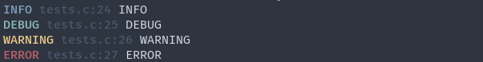

# debug/

Debugging utilities

## log.c - logging library
This is a basic logger.
Functions:
- `log(int level,char* format,...)`Will log depending on the level. Types of levels: INFO,WARNING,DEBUG,ERROR.

## unit.c - Unit testing library
Basic unit testing library.
Functions:
- `TEST_EQUAL(a,b)` Will test if two variables are equal.
